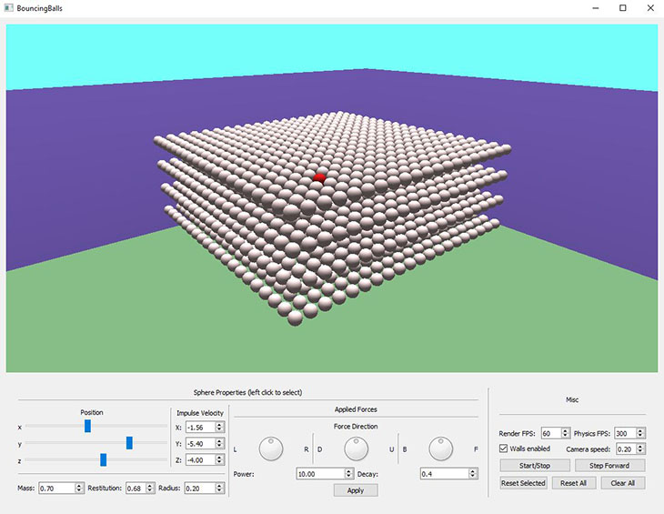

# bouncing-balls

  

## Overview

A physics simulation sandbox implemented in C++ using OpenGL for graphics rendering and Qt for the UI. It allows for the dynamic creation of ball objects, live editing of ball properties and the application of external forces in real time.

It can successfully simulate 1500+ objects on an i7-5700 @ 2.7GHz and GeForce 950M.

## Running
Project was developed and compiled under Windows 10 x64, Visual Studio 2019 (v142), Window SDK 10.0.18362. The standalone release executable is located under `x64/Release`. Simply copy the directory and run `BouncingBalls.exe` on a Windows 10 machine.
